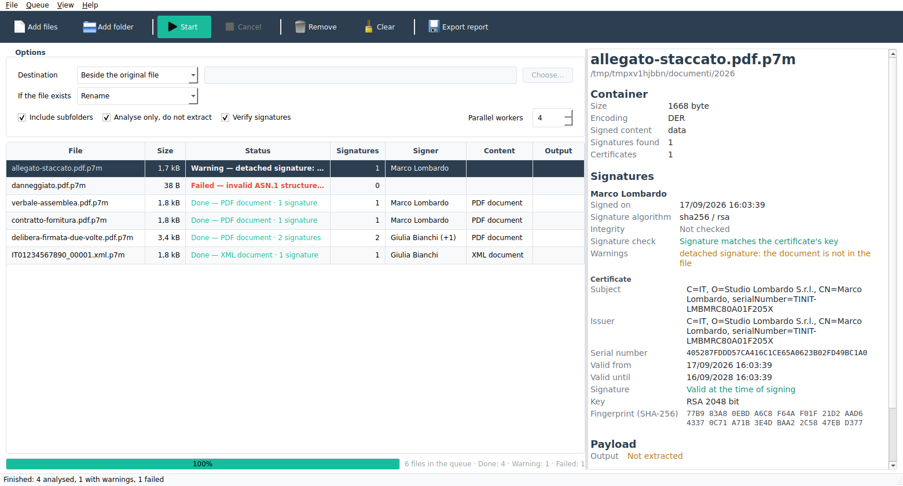
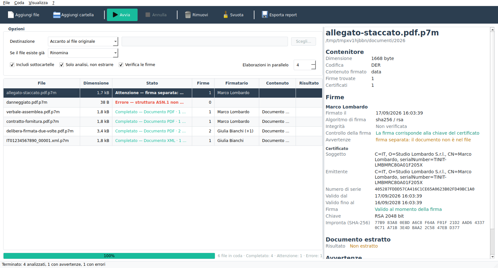

# 🔏 P7M Manager — signed containers, opened

[](https://www.gnu.org/licenses/agpl-3.0)
[](COMMERCIAL-LICENSE.md)
[](https://www.python.org/downloads/)
[](https://github.com/MarcoLombardoDev/P7MManager/actions/workflows/ci.yml)

A desktop tool for `.p7m` files: see what is inside them, who signed them and when, and get
the document back out. One file or a whole folder tree, worked through as a queue.

> 🔒 No account. No server. No cloud. No telemetry. Everything happens on your machine, and
> the container itself is only ever read — never modified, never moved.

---

## Screenshots

| | |
|---|---|
| **English** — the queue, the options and the details of the selected container | **Italiano** — la stessa finestra |
|  |  |

The screenshots are generated from the running application by
`python tools/screenshot.py`, against containers signed on the spot — so they
cannot drift away from what the window actually draws.

---

## Table of Contents

1. [What P7M Manager is](#what-p7m-manager-is)
2. [Features](#features)
3. [Download](#download)
4. [Installation from source](#installation-from-source)
5. [Usage](#usage)
6. [How it works](#how-it-works)
7. [Requirements](#requirements)
8. [Development](#development)
9. [Testing](#testing)
10. [Building a standalone executable](#building-a-standalone-executable)
11. [Troubleshooting](#troubleshooting)
12. [Scope and limitations](#scope-and-limitations)
13. [License & Commercial Licensing](#license--commercial-licensing)
14. [Contributing](#contributing)
15. [Disclaimer](#disclaimer)

---

## What P7M Manager is

A `.p7m` is a CMS/PKCS#7 envelope: a document with one or more digital signatures wrapped
around it. Italian invoices, PEC attachments and signed contracts arrive this way, and a
plain PDF reader cannot open them.

P7M Manager does three things with such a file:

- **Says what is inside it** — the document's type and size, how many signatures it
  carries, who signed it and when, with the full certificate behind each signature.
- **Checks what can honestly be checked** — that the document still matches the digest the
  signature covers, and, for RSA, that the signature was produced by the enclosed
  certificate's key.
- **Gets the document out** — the PDF, the XML, or whatever else the envelope holds,
  written next to the original or wherever you say.

Point it at a single file, or at a folder with five hundred of them: everything goes into a
queue that runs on several threads, and each row says what happened.

### Your documents never leave your machine

A `.p7m` is rarely something trivial. It is a contract, an invoice, a court filing, a
letter carrying somebody's personal data — material you are often not free, and sometimes
not legally permitted, to hand to a third party. So how a tool treats the file matters as
much as what it gets out of it.

P7M Manager is a desktop application, and that is the whole of its privacy design:

- **Nothing is uploaded.** Parsing, verification and extraction all happen in this process,
  on your machine. The container is opened read-only and never modified or moved; the
  extracted document is written where you said and nowhere else.
- **Nothing is sent, because nothing can be.** The application opens no network connections
  at all. It imports no networking module — not `socket`, not `urllib.request`, not Qt's
  own network classes — and `tests/test_privacy.py` fails if one ever appears. Another test
  runs a full analysis and extraction with sockets made unusable, so the engine is known to
  work on a machine with the cable pulled out.
- **No account, no licence key, no activation.** There is nothing to sign into and nothing
  to register. The software behaves identically whether or not anyone has paid for a
  commercial licence.
- **No telemetry, no analytics, no crash reporting.** Not disabled by default — absent.
- **Verifiable rather than promised.** The source is AGPL-3.0, so the claims above can be
  read rather than believed; and since the application is a local process, a firewall rule
  or an air-gapped machine settles the question without reading anything at all.

**What it does write to disk**, so that this list is complete: your preferences, in a JSON
file under the usual configuration directory for your platform; a rotating local log of
what the application did — paths and errors, never the contents of a document; and the
documents you asked it to extract. All of it stays on your machine, and deleting the
configuration directory removes the first two.

### Why this is not a small point

A .p7m cannot be opened by an ordinary PDF reader, so the usual next step is an online
converter: upload the file, get the document back. That is not a criticism of any
particular service — it is simply what uploading means. The document reaches a machine you
do not control, and for anything under professional secrecy, a non-disclosure agreement or
the GDPR, that transfer is a decision someone has to be in a position to make, document and
justify.

A desktop tool removes the question rather than answering it. There is no processor to
assess, no data-processing agreement to sign, no retention policy to read, and no incident
on somebody else's infrastructure that could involve your documents. The file stays where
it already was.

### What this tool does not claim

**P7M Manager is not a legal validation service, and nothing it reports is a legal
validation of a signature.**

| It does check | It does **not** check |
|---|---|
| That the enclosed document matches the digest the signature covers | Whether the certificate chains to a trusted qualified authority |
| That an RSA signature matches the signer's public key | Whether the certificate was **revoked** — there is no revocation check, neither CRL nor OCSP |
| Whether the certificate's validity window covered the signing time | Whether a timestamp is genuine, by asking the authority that issued it |
| What the certificate says about itself, including qualified-signature statements | Whether the signer was entitled to sign that document |

Signatures using ECDSA or RSA-PSS are reported as **not verified by this tool** rather than
guessed at — an unverified signature is never shown as a valid one.

Where a legal determination is needed, use an accredited validation service. What this tool
is good for is the question those services answer slowly and this one answers instantly:
*what is this file, is it intact, and can I have the document?*

## Features

**Reading the envelope**

- CMS `SignedData`, DER or BER, including the indefinite lengths and segmented octet
  strings some signing devices produce
- Base64 and PEM-armoured containers, as several PEC providers deliver them
- Envelopes nested inside envelopes, unwrapped to the document (up to eight deep)
- Detached signatures, reported as such instead of silently producing nothing
- Multiple signatures, counter-signatures and RFC 3161 timestamps
- A fallback that recovers an embedded PDF from a container too damaged to parse — what the
  shell scripts this tool replaces did for every file

**Saying what is inside**

- Signer, signing time, digest and signature algorithms
- The signer's certificate: subject and issuer, serial number, validity window, key size,
  qualified-certificate statements, SHA-256 fingerprint
- Whether the certificate was valid *at the moment of signing*, not merely today
- Integrity and signature verdicts, each stated for what it is

**Getting the document out**

- PDF, XML, OOXML, legacy Office, images, archives — identified from the content, not from
  the file name
- The inner extension is restored: `fattura.xml.p7m` becomes `fattura.xml`, and
  `allegato.p7m` holding a PDF becomes `allegato.pdf`
- Written beside the original, into a single folder, or into a mirror of the source tree
- Existing files renamed around, overwritten, or skipped — your choice
- Written atomically: an interrupted run leaves a complete file or none

**Working through a folder**

- Files, folders, or a drag-and-drop of either
- Recursive scanning, a queue that can be cancelled and re-run, several files at a time
- Per-file status, a details panel, and CSV or JSON reports of the whole run

**And**

- English and Italian
- A command line covering the same engine, for scheduled tasks

## Download

The [releases page](https://github.com/MarcoLombardoDev/P7MManager/releases) carries a
build for each platform. Nothing needs installing: unpack it and run it.

Every archive unpacks to a single folder called **`P7M Manager`**, the same on all three
platforms:

```
P7M Manager/
├── start.cmd              ← Windows: this is what you run
├── P7MManager.exe         (P7MManager on Linux, P7MManager.app on macOS)
├── P7MManager.exe.sha256  the executable's checksum, which start.cmd verifies
├── _internal/             Qt and the interpreter — leave it alone
├── LICENSE
├── COMMERCIAL-LICENSE.md
├── README.md
└── CHANGELOG.md
```

On Linux and macOS the launcher is `start.sh` and `start.command` respectively; both do the
same thing. **Run the launcher rather than the executable**: it recomputes the checksum
shipped beside the program and refuses to start something that does not match, which is
what catches a truncated download or a half-finished unpack. Pass it arguments and they go
straight through — `start.cmd --cli documenti -r` works.

The builds are unsigned, so the first launch brings a warning on every platform: on Windows
*More info → Run anyway*, on macOS *right-click → Open*. Only a code-signing certificate
removes those, and this project has none.

To check the download itself rather than what came out of it, the SHA-256 of every archive
is printed in the release notes — it reaches you by a different path from the archive,
which is what makes it worth checking:

```bash
sha256sum P7MManager-1.0.0-linux-x64.tar.gz    # compare with the release page
```

## Installation from source

### From a clone

```bash
git clone https://github.com/MarcoLombardoDev/P7MManager.git
cd P7MManager
python -m venv .venv
source .venv/bin/activate          # Windows: .venv\Scripts\activate
pip install -r requirements.txt
python -m p7mmanager
```

### As a package

```bash
pip install .
p7mmanager                         # the window
p7m --help                         # the console tool
```

## Usage

### Using the window

1. **Add files** or **Add folder** — or drag either onto the window.
2. Choose where the extracted documents go: beside the original, into one folder, or into a
   mirror of the source tree.
3. Press **Start**.
4. Click any row to see what is inside that container: signatures, certificates, verdicts.
5. **Export report** writes the whole run to CSV or JSON.

Tick **Analyse only** to inspect a folder without writing anything — useful for finding out
what is in an archive before touching it.

### Using the command line

The console tool covers the same engine, and the `-r` and `-d` flags behave as they did in
the PowerShell and Python scripts this tool replaces:

```bash
python -m p7mmanager --cli                            # the current folder
python -m p7mmanager --cli /path/to/documents -r      # recursively
python -m p7mmanager --cli /path/to/documents -r -d   # as a table
python -m p7mmanager --cli docs -o estratti --mirror  # elsewhere, same structure
python -m p7mmanager --cli docs -n                    # analyse only, write nothing
python -m p7mmanager --cli docs -r --csv report.csv   # with a report
```

| Option | What it does |
|---|---|
| `-r`, `--recurse` | scan subfolders as well |
| `-d`, `--detailed` | print a table instead of one line per file |
| `-o`, `--output` | write the documents here instead of beside the originals |
| `--mirror` | with `-o`, recreate the source folder structure |
| `-n`, `--analyse-only` | report what is inside without writing anything |
| `--overwrite`, `--skip-existing` | what to do when the output file exists |
| `--no-verify` | skip the checks (faster on very large batches) |
| `-j N`, `--workers N` | how many files at a time |
| `--csv`, `--json` | also write a report |
| `-q`, `--quiet` | only print what needs attention |

Exit codes: `0` everything fine, `1` nothing found, `2` a report could not be written,
`3` at least one file failed.

## How it works

The envelope is read directly: `p7mmanager/core/` contains its own ASN.1/BER reader, CMS
parser and X.509 reader, written against the standard library. There is no OpenSSL to
install, no cryptography wheel to build, and nothing to configure — which matters on a
locked-down corporate desktop, and is also a licensing decision (see
[§11 of the commercial licence](COMMERCIAL-LICENSE.md#11-third-party-components)).

Verification uses `hashlib` for digests and integer arithmetic for RSA PKCS#1 v1.5.

The engine knows nothing about Qt: the window, the command line and the test-suite all
drive the same code, and a test fails if a Qt import ever appears under `core/`.
[docs/ARCHITECTURE.md](docs/ARCHITECTURE.md) has the details.

## Requirements

- **Python 3.10 or later**
- **PySide6 6.6+** — for the window only; the command line needs nothing but the standard
  library
- Windows, macOS or Linux

## Development

```bash
pip install -r requirements-dev.txt
ruff check .
```

See [CONTRIBUTING.md](CONTRIBUTING.md) and [CLAUDE.md](CLAUDE.md). Contributions need a
signed [Contributor Licence Agreement](CLA.md) — see [Contributing](#contributing) below.

## Testing

```bash
pytest                             # the whole suite
pytest tests/test_docs.py -q       # the documentation guards alone, in seconds
```

The test fixtures are real containers, signed by the `openssl` binary when the tests are
collected rather than committed as blobs. Where OpenSSL is missing those tests skip and the
rest still run.

Four of the suites check this repository rather than the program: `test_docs.py` holds the
documents to each other, `test_release_workflow.py` holds the workflow that publishes a
release, `test_packaging.py` holds the icons and the spec, and
`test_third_party_licences.py` holds what the archive says about everybody else's code.

## Building a standalone executable

```bash
pip install pyinstaller
pyinstaller p7mmanager.spec
```

The result lands in `dist/P7MManager/`. Read the exclusions in `p7mmanager.spec` before
changing them: one of them keeps a GPL-3 library with no linking exception out of the
archive, which matters to anyone redistributing a build.

That is the program alone. The release workflow is what turns it into the download
described above — it renames the folder to `P7M Manager`, drops the launcher and the
licence texts in beside the executable, writes the checksum the launcher verifies, and
starts the bundle through the launcher before publishing it. The application icon is drawn
by `tools/make_icon.py` and committed, so a build never depends on which fonts a runner
happens to have: see [resources/icons/README.md](resources/icons/README.md).

## Troubleshooting

**"detached signature: nothing to extract"** — the container carries only the signature;
the document travels beside it as a separate file. There is nothing inside to write out.

**"CMS content is not signed data (envelopedData)"** — the file is *encrypted*, not signed.
P7M Manager reads signatures; it does not decrypt.

**A row is amber with "recovered by scanning"** — the signature structure could not be
parsed, and the PDF was carved out of the bytes instead. The document is usable, but
nothing about its signature was verified.

**"signature not verified by this tool"** — the signature uses ECDSA or RSA-PSS. The
integrity check still applies; the signature itself was not checked.

**The window does not start on Linux** — Qt needs its platform libraries:
`sudo apt install libegl1 libgl1 libxkbcommon0 libfontconfig1`. Check with
`python -m p7mmanager --self-check`.

## Scope and limitations

What this tool does and does not claim is in
[What this tool does not claim](#what-this-tool-does-not-claim), above: it checks
integrity and, for RSA, the signature itself, and it is not a legal validation service.

The engine reads containers; it never writes one. A `.p7m` opened here is opened
read-only, and nothing in this program can alter, re-sign or re-wrap a signed document.

---

## License & Commercial Licensing

P7M Manager is open-source software released under the
**[GNU Affero General Public License v3.0](LICENSE)**.

Copyright © 2026 Marco Lombardo.

**The free build is the whole product.** Every feature documented above is in it. There is
no paid edition, no feature gate, no licence key, no seat limit and no phone-home.

| Use case | Allowed? | Obligation |
|---|---|---|
| Internal use, any number of machines and users | ✅ Yes | None |
| Modify it and keep the changes to yourself | ✅ Yes | None |
| Fork and publish on GitHub | ✅ Yes | Must stay AGPL-3.0 |
| Deploy a modified version as a network service | ✅ Yes | Must publish your modified source |
| Integrate into a **closed-source product** used internally | ⚠️ Restricted | Requires a Commercial licence |
| Embed its engine in a product you **sell to third parties** | ❌ Not under AGPL | Requires a Redistribution licence |

The dividing line is one rule: **AGPL-3.0 is free as long as the source stays open.**

### Commercial Licensing

The commercial offer removes the copyleft obligation, and nothing else. It splits into two
branches that answer different questions — **Commercial**, sized by how big the organisation
using P7M Manager internally is, and **Redistribution**, needed whenever the software, or
its engine, reaches third parties, regardless of size:

```
Community         AGPL-3.0, free
Commercial        Small (1–49 employees) · Medium (50–249) · Large (250–999) · Enterprise (1,000+ / group)
Redistribution    Standard · Enterprise
```

| Tier | Price | Perpetual | Scope |
|---|---:|---:|---|
| **Community** | **Free** | — | Everything P7M Manager does, under AGPL-3.0. Unlimited internal use. |
| **Commercial — Small** | **€900 / year** | €2,700 | 1–49 employees, internal use, one legal entity. |
| **Commercial — Medium** | **€1,800 / year** | €5,400 | 50–249 employees, internal use, one legal entity. |
| **Commercial — Large** | **€3,200 / year** | €9,600 | 250–999 employees, internal use, one legal entity. |
| **Commercial — Enterprise** | **from €5,500 / year** | — | 1,000+ employees, or a Corporate Group scope. |
| **Redistribution — Standard** | **€2,900 / year** | €8,700 | Embed it, or its engine, in a product you sell. |
| **Redistribution — Enterprise** | **from €10,000 / year** | — | Large-scale distribution — worldwide, high volume, or OEM. |

A perpetual licence is three times the annual rate of the same tier, bought once, covering
the major version current at purchase. Both Enterprise tiers are negotiated per case
instead.

The same commitments apply at every paid tier:

- **Email support is always included** — 5 business days at Commercial Small down to 2 at
  either Enterprise tier. It is never sold separately to a paying customer.
- **Custom development is never included**, at any tier. It is quoted separately, per
  project, at a fixed price agreed before work starts (indicative day rate: **€500 / day**).
- **No retroactive price rise, cancel any time.** Versions released during your term stay
  licensed to you.
- **50% off** for organisations under 10 employees and €1M revenue. **Free** commercial
  licences for non-profits, academia and published research — ask.

A Commercial licence, below Enterprise, covers exactly one legal entity: it does not
automatically extend to other companies in the same group, and it does not include
redistribution, OEM or embedding rights — those need a Redistribution licence on top.
Prices are per licensed legal entity, excluding VAT. **Seats are never counted.**

Note what a Redistribution licence is needed for here that is easy to miss: using
`p7mmanager.core` as a signature-reading library inside your own product is redistribution,
even though no window is involved.

Full terms, the Employee Count and Corporate Group definitions, and the third-party
component review: **[COMMERCIAL-LICENSE.md](COMMERCIAL-LICENSE.md)**. Enquiries go to
[marco.lombardo@gmail.com](mailto:marco.lombardo@gmail.com?subject=P7M%20Manager%20commercial%20licence%20enquiry).

---

## Contributing

Contributions are welcome. All contributors must agree to the
[Contributor License Agreement (CLA)](CLA.md) before a Pull Request can be merged: the
commercial licence above is only possible if one party can license the whole work both
ways, and the CLA is what makes that true.

> **To agree:** include
> `I have read and agree to the Contributor License Agreement (CLA.md).`
> in your Pull Request description. Your first Pull Request constitutes your agreement.

Practical expectations:

- Never commit a real `.p7m`. The test fixtures are generated and signed at collection
  time by `openssl`, precisely so that no signed document of anybody's ends up in this
  history.
- Every bug fix arrives with a test that fails without the fix.
- Bump the version only in `p7mmanager/__init__.py`, and add a `CHANGELOG.md` entry.
- **The engine keeps its zero dependencies.** `p7mmanager/core/` is written against the
  standard library, and that is what lets this be offered under a commercial licence at
  all: a copyleft crypto stack in there would make the offer undeliverable.

[`CONTRIBUTING.md`](CONTRIBUTING.md) covers the process in full.

---

## Disclaimer

*P7M Manager is provided as is, without warranty of any kind. It checks integrity and, for
RSA, the signature itself — it does not validate signatures legally. See
[What this tool does not claim](#what-this-tool-does-not-claim).*

**It is not a qualified validation service.** A legally binding verification of an Italian
digital signature is something an accredited provider does, against the trust lists and at
the time the signature was made. This program reads the container and tells you what is in
it.
